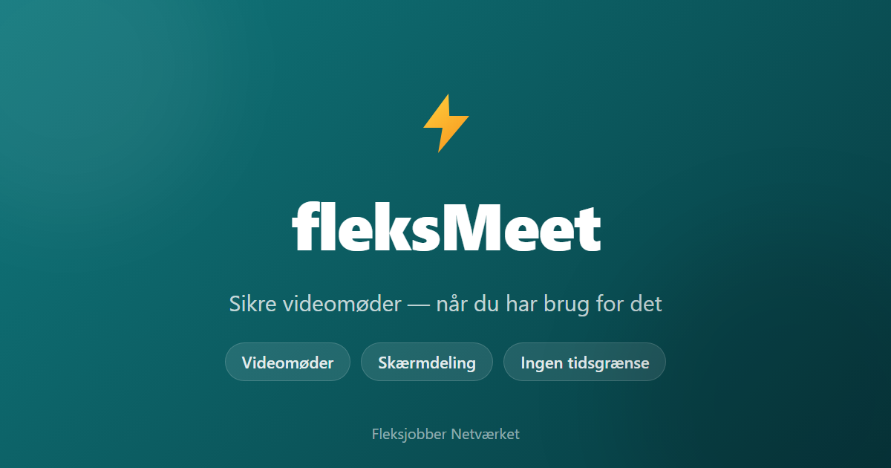

# fleksMeet

fleksMeet is a video meeting app for Fleksjobbernetværket, built on
[Cloudflare Realtime SFU](https://developers.cloudflare.com/realtime/). It's a
fork of Cloudflare's "Meet" demo (formerly "Orange Meets") — to build your own
WebRTC application on Cloudflare Realtime from scratch, see the
[Cloudflare Dashboard](https://dash.cloudflare.com/?to=/:account/realtime) or
the simpler [realtime-examples](https://github.com/cloudflare/realtime-examples).

For engineers working on this repo:

- **[ARCHITECTURE.md](ARCHITECTURE.md)** — deep technical reference: request
  flow, the Durable Object that runs each meeting, the full D1 schema,
  auth/session/password design, the WebRTC signaling path, deployment
  pipeline. Read this before making non-trivial changes.
- **[CLAUDE.md](CLAUDE.md)** — running log of what changed and why, kept
  up to date after each work session (AI-assisted or not).



## Variables

Go to the [Cloudflare Realtime dashboard](https://dash.cloudflare.com/?to=/:account/realtime) and create an application.

Put these variables into `.dev.vars`

```
CALLS_APP_ID=<APP_ID_GOES_HERE>
CALLS_APP_SECRET=<SECRET_GOES_HERE>
ADMIN_USERNAME=<CHOOSE_AN_ADMIN_USERNAME>
HOST_PASSWORD=<CHOOSE_A_STRONG_SHARED_PASSWORD>
```

### Optional variables

The following variables are optional:

- `MAX_WEBCAM_BITRATE` (default `1200000`): the maximum bitrate for each meeting participant's webcam.
- `MAX_WEBCAM_FRAMERATE` (default: `24`): the maximum number of frames per second for each meeting participant's webcam.
- `MAX_WEBCAM_QUALITY_LEVEL` (default `1080`): the maximum resolution for each meeting participant's webcam, based on the smallest dimension (i.e. the default is 1080p).
- `ADMIN_USERNAME` (required to enable host features at all — "Bliv vært" shows "not configured" without it): the username that must be entered alongside a password to claim host. There's only one admin username for the whole deployment, not one per person.
- `HOST_PASSWORD` (optional): a master password that works with `ADMIN_USERNAME` to claim host in any room. It's optional because each meeting also gets its own password automatically — the first person who enters the correct `ADMIN_USERNAME` and any password (min. 4 characters) sets that meeting's password (stored hashed in D1); anyone who later enters the same username+password also becomes host, e.g. after a reconnect. Host controls: mute all, remove participants, lock the room, toggle chat.

To customize these variables, place replacement values in `.dev.vars` (for development) and in the `[vars]` section of `wrangler.toml` (for the deployment).

### Welcome screen

Visiting the site (`/`) always shows fleksMeet's own welcome screen — it
never redirects away to another URL, even for a first-time visitor. Two
buttons choose the flow:

- **Fortsæt som gæst** — enter a display name and join. Guest display
  names are limited to 10 characters, letters only (`A-Za-z` plus Danish
  `æøå`), with optional digits at the very end (e.g. `Knud99`). A
  lowercase first letter is silently capitalized rather than rejected;
  anything else invalid shows an inline error. Guests may only join a
  meeting that's already active — they can't spin one up by typing an
  arbitrary room name.
- **Som admin** — username + password, for both the shared
  `ADMIN_USERNAME`/`HOST_PASSWORD` login and real user accounts (see
  "User accounts" below).

A small "?" icon in the top-right corner opens a one-line help popup.
`/set-username` renders the identical screen and is still the gate a
protected URL (e.g. a direct room link) redirects to when no one is
logged in yet.

### Admin panel

Visit `/admin` and log in with `ADMIN_USERNAME` + `HOST_PASSWORD` (both required — `/admin/login` shows "not configured" without them) to:

- pre-configure a room by name before anyone joins it (locked from start, chat off from start, a preset host password),
- see configured rooms and recent/active meetings, and
- remotely control any active meeting (lock/unlock, toggle chat, mute all, remove a participant) without joining it.

Like the other D1-backed features above, this needs a bound database (`wrangler d1 create`, then fill in the `[[d1_databases]]` block in `wrangler.toml`, then `npm run db:migrate`) — without one, `/admin/login` still works but the dashboard shows empty lists and room pre-configuration is silently skipped.

If no admin account exists yet, `/admin/setup` creates the first one directly (no env-var secrets needed) — it locks itself once an admin exists.

### User accounts

From the admin dashboard, admin can also create named accounts with a role — `Admin`, `Ordstyrer` (moderator), or `Bruger` (regular user) — by entering a username, email, and role. The person gets emailed a one-time link to `/set-password` where they choose their own display name and password; until they do, the account shows as "Afventer aktivering" in the dashboard. Once activated, they can log in from the entry screen's "Som admin" tab with that username/password. A `moderator` account is automatically host in every meeting they join (no manual "Bliv vært" needed); an `admin` account also gets `/admin` access on login.

Sending the invite email uses [Resend](https://resend.com) — set `RESEND_API_KEY` (and optionally `RESEND_FROM_EMAIL`, which needs a domain verified in Resend; without it, email sends from Resend's shared test address). If `RESEND_API_KEY` isn't set, or sending fails, the dashboard shows the raw invite link instead so it can be shared manually.

### Naming and versioning

The product name shown to users ("fleksMeet", in the page title, welcome
screen, webmanifest, share preview) and its version number both live in
[app/utils/appInfo.ts](app/utils/appInfo.ts) — bump `APP_VERSION` there
when shipping a notable change (see `CLAUDE.md`'s log for the convention).
This is separate from the `© ... Vores Events - Fleksjobber Netværket`
footer text, which is a company/organization attribution, not the product
name.

### Sharing the link

The site has Open Graph / Twitter Card meta tags (see `app/root.tsx`) so
sharing the URL on LinkedIn, Slack, etc. shows a real preview card —
title, description, and [public/og-image.png](public/og-image.png).
Regenerate that image if the brand colors, logo, or name change (it's a
static screenshot, not rendered live).

## Development

```sh
npm install
npm run dev
```

Open up [http://127.0.0.1:8787](http://127.0.0.1:8787) and you should be ready to go!

Before committing, run `npm run check` (prettier + eslint + typecheck +
tests) — CI runs the same steps and stops at the first failure, so a
lint issue silently hides whatever typecheck/test problems come after it.

## Deployment

1. Make sure you've installed `wrangler` and are logged in by running:

```sh
wrangler login
```

2. Update `CALLS_APP_ID` in `wrangler.toml` to use your own Calls App ID

3. You will also need to set the token as a secret by running:

```sh
wrangler secret put CALLS_APP_SECRET
```

or to programmatically set the secret, run:

```sh
echo REPLACE_WITH_YOUR_SECRET | wrangler secret put CALLS_APP_SECRET
```

4. Optionally, you can also use [Cloudflare's TURN Service](https://developers.cloudflare.com/calls/turn/) by setting the `TURN_SERVICE_ID` variable in `wrangler.toml` and `TURN_SERVICE_TOKEN` secret using `wrangler secret put TURN_SERVICE_TOKEN`

4b. To enable host features, set an admin username and (optionally) a master password: `wrangler secret put ADMIN_USERNAME` and `wrangler secret put HOST_PASSWORD` (see "Optional variables" above)

4c. Run the D1 migrations (host passwords, chat history, admin action log, rooms, user accounts): `npm run db:migrate`

4d. To enable emailed set-password invitations for created user accounts, set `wrangler secret put RESEND_API_KEY` (get a key from [resend.com](https://resend.com)) and optionally `RESEND_FROM_EMAIL` if you've verified your own sending domain there

5. Also optionally, you can include `OPENAI_MODEL_ENDPOINT` and `OPENAI_API_TOKEN` to use OpenAI's [Realtime API with WebRTC](https://platform.openai.com/docs/guides/realtime-webrtc) to [invite AI](https://www.youtube.com/watch?v=AzMpyAbZfZQ) to join your meeting.

6. Finally you can run the following to deploy:

```sh
npm run deploy
```

In this project's actual deployment, pushing to `main` on GitHub also
triggers a Cloudflare Workers Build automatically (separate from, and not
gated by, the GitHub Actions checks) — see **ARCHITECTURE.md → Deployment
pipeline** for details.
