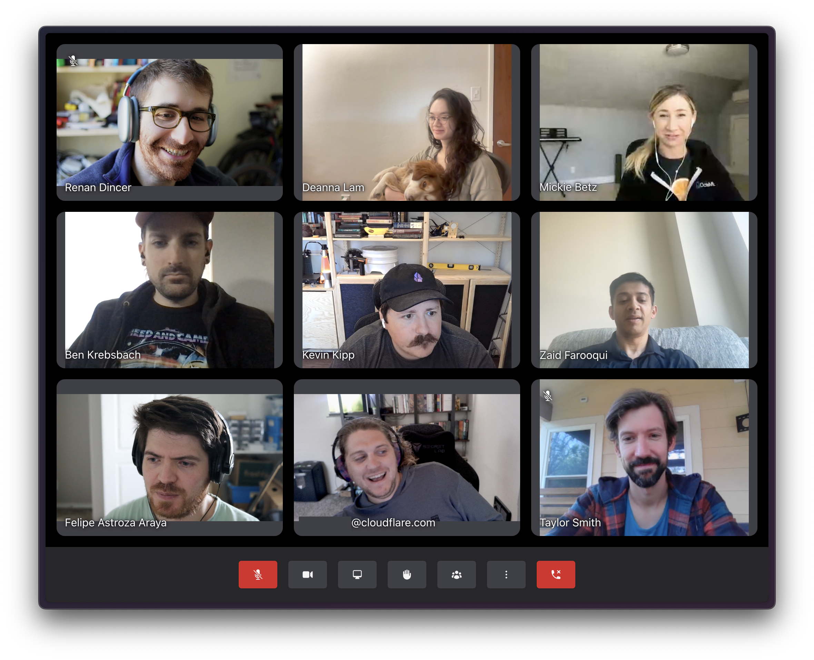
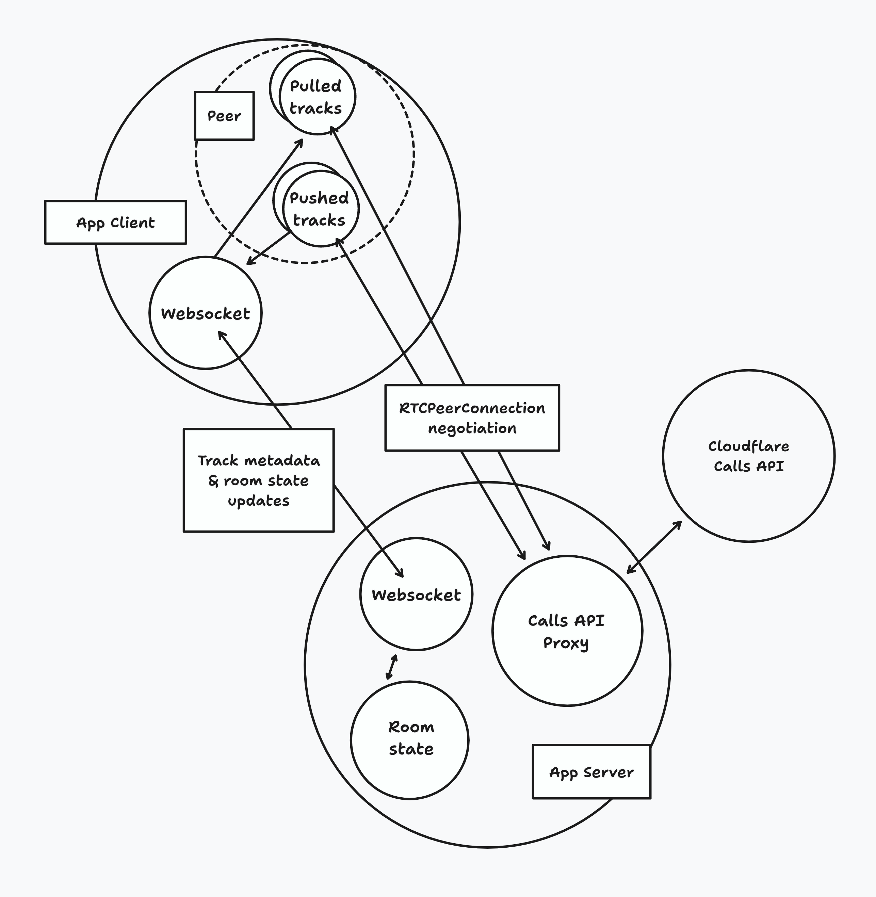

# Welcome to Cloudflare Meet

(Cloudflare Meet was formerly known as Orange Meets)

Meet is a demo application built using [Cloudflare Realtime SFU](https://developers.cloudflare.com/realtime/). To build your own WebRTC application using Cloudflare Realtime, get started in the [Cloudflare Dashboard](https://dash.cloudflare.com/?to=/:account/realtime).

Simpler examples can be found [here](https://github.com/cloudflare/realtime-examples).

[Try the demo here!](https://demo.orange.cloudflare.dev)



## Architecture Diagram



## Variables

Go to the [Cloudflare Realtime dashboard](https://dash.cloudflare.com/?to=/:account/realtime) and create an application.

Put these variables into `.dev.vars`

```
CALLS_APP_ID=<APP_ID_GOES_HERE>
CALLS_APP_SECRET=<SECRET_GOES_HERE>
ADMIN_USERNAME=<CHOOSE_AN_ADMIN_USERNAME>
HOST_PASSWORD=<CHOOSE_A_STRONG_SHARED_PASSWORD>
```

### Optional variables

The following variables are optional:

- `MAX_WEBCAM_BITRATE` (default `1200000`): the maximum bitrate for each meeting participant's webcam.
- `MAX_WEBCAM_FRAMERATE` (default: `24`): the maximum number of frames per second for each meeting participant's webcam.
- `MAX_WEBCAM_QUALITY_LEVEL` (default `1080`): the maximum resolution for each meeting participant's webcam, based on the smallest dimension (i.e. the default is 1080p).
- `ADMIN_USERNAME` (required to enable host features at all — "Bliv vært" shows "not configured" without it): the username that must be entered alongside a password to claim host. There's only one admin username for the whole deployment, not one per person.
- `HOST_PASSWORD` (optional): a master password that works with `ADMIN_USERNAME` to claim host in any room. It's optional because each meeting also gets its own password automatically — the first person who enters the correct `ADMIN_USERNAME` and any password (min. 4 characters) sets that meeting's password (stored hashed in D1); anyone who later enters the same username+password also becomes host, e.g. after a reconnect. Host controls: mute all, remove participants, lock the room, toggle chat.

To customize these variables, place replacement values in `.dev.vars` (for development) and in the `[vars]` section of `wrangler.toml` (for the deployment).

## Development

```sh
npm install
npm run dev
```

Open up [http://127.0.0.1:8787](http://127.0.0.1:8787) and you should be ready to go!

## Deployment

1. Make sure you've installed `wrangler` and are logged in by running:

```sh
wrangler login
```

2. Update `CALLS_APP_ID` in `wrangler.toml` to use your own Calls App ID

3. You will also need to set the token as a secret by running:

```sh
wrangler secret put CALLS_APP_SECRET
```

or to programmatically set the secret, run:

```sh
echo REPLACE_WITH_YOUR_SECRET | wrangler secret put CALLS_APP_SECRET
```

4. Optionally, you can also use [Cloudflare's TURN Service](https://developers.cloudflare.com/calls/turn/) by setting the `TURN_SERVICE_ID` variable in `wrangler.toml` and `TURN_SERVICE_TOKEN` secret using `wrangler secret put TURN_SERVICE_TOKEN`

4b. To enable host features, set an admin username and (optionally) a master password: `wrangler secret put ADMIN_USERNAME` and `wrangler secret put HOST_PASSWORD` (see "Optional variables" above)

4c. Run the D1 migration that adds meeting host passwords, chat history and the admin action log: `npm run db:migrate:production` (or `:staging` / `:development` for those environments)

5. Also optionally, you can include `OPENAI_MODEL_ENDPOINT` and `OPENAI_API_TOKEN` to use OpenAI's [Realtime API with WebRTC](https://platform.openai.com/docs/guides/realtime-webrtc) to [invite AI](https://www.youtube.com/watch?v=AzMpyAbZfZQ) to join your meeting.

6. Finally you can run the following to deploy:

```sh
npm run deploy
```
